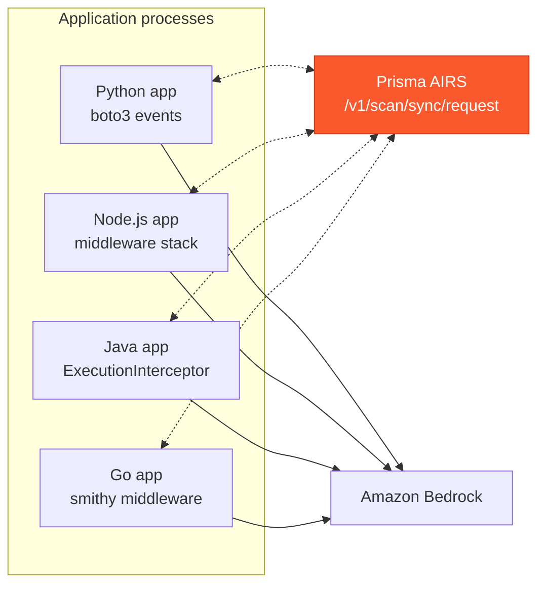

# Amazon Bedrock SDK Hooks with Prisma AIRS

One integration pattern, four languages. Each member of this family registers on the **native interceptor mechanism of its AWS SDK** so that every Amazon Bedrock model invocation made through a protected client is scanned by Palo Alto Networks Prisma AI Runtime Security (AIRS) -- including calls a framework makes on the application's behalf. A blocked prompt is stopped **before the request is signed or sent**: nothing reaches AWS, nothing is billed.

## Why this seat

A Bedrock guardrail is a **request parameter**: every call site must remember to pass it, and a call without it -- a new code path, a framework internal, a developer shortcut -- is silently unguarded. An SDK interceptor is registered **on the client**: every call through it is scanned, whoever makes it. The two compose; this integration is the safety net under whatever else is configured.

## The family

| Language | Directory | SDK | Interception mechanism | Registration |
|----------|-----------|-----|------------------------|--------------|
| Python | [python](./python/) | boto3 / botocore | botocore event system (`before-call` / `after-call`) | per client or per session |
| Node.js | [nodejs](./nodejs/) | AWS SDK for JavaScript v3 | middleware stack | per client |
| Java | [java](./java/) | AWS SDK for Java v2 | `ExecutionInterceptor` | per client, or **classpath auto-discovery** (every client in the JVM) |
| Go | [go](./go/) | AWS SDK for Go v2 | smithy middleware | per client, or per `aws.Config` (every client built from it) |

All four enforce the same contract:

- **Prompt leg pre-flight**: the system prompt and every user-role message are scanned before signing; a block means the request never leaves the process
- **Response leg**: scanned before the application sees it; blocked responses withheld or replaced
- **Allowlist content walkers**: each language extracts the text-bearing block shapes it knows -- in the `Converse` dialect `text`, `guardContent` text, `toolUse` name and input, `toolResult` text and JSON, reasoning text, and `searchResult` and citation text; in the type-tagged messages dialect the `system` field plus `text`, `tool_use`, `tool_result` and `thinking` blocks. Where an SDK cannot express one of these cases, that language's README says so under Limitations
- **Unknown shapes fail closed**: documents, images, video, audio, redacted reasoning and any block type a future SDK version adds are marked unscannable; the sole exception is a `cachePoint` marker, which carries no content and is neither extracted nor flagged. Nothing falls off the end unexamined
- **Fail-closed defaults**: missing credentials, unreachable AIRS, a verdict without an action, and content marked unscannable all block unless explicitly relaxed
- **Two blocking styles**: an exception/error carrying the verdict, or a well-formed `content_filtered` response for callers that cannot be taught a new error type
- **AWS error passthrough**: throttles and auth failures are never masked by a scan verdict
- **Standard env vars** (`PRISMA_AIRS_API_KEY`, `PRISMA_AIRS_PROFILE_NAME`, `PRISMA_AIRS_URL`) and the same scan metadata: `transaction_id` per call, `ai_model` stamped from the request's model id, optional session and user attribution

## Coverage

> For detection categories and use cases, see the [Prisma AIRS documentation](https://pan.dev/prisma-airs/api/airuntimesecurity/usecases/).

| Scanning Phase | Supported | Description |
|----------------|:---------:|-------------|
| Prompt | ✅ | Every model call through a protected client is scanned pre-flight; a blocked prompt is never signed, sent, or billed |
| Response | ✅ | `Converse` and `InvokeModel` responses are scanned before the application sees them |
| Streaming | ⚠️ | The prompt leg of the streaming operations is scanned exactly as the non-streaming one is; the streamed response itself is not |
| Pre-tool call | ❌ | Tool use rides inside message content at this seat; the agent-loop integrations scan it as first-class `tool_event` payloads |
| Post-tool call | ❌ | Same -- see [bedrock-agentcore](../bedrock-agentcore/) and [strands-agents](../strands-agents/) |

## Getting started

1. Pick your language directory above
2. Copy the single integration file (plus, for Java, the interceptor class) into your project
3. Set the three standard environment variables and run the directory's `scripts/validate` against the live API

## Resources

- [Prisma AIRS API Reference](https://pan.dev/airs/)
- [Amazon Bedrock Runtime API](https://docs.aws.amazon.com/bedrock/latest/APIReference/API_Operations_Amazon_Bedrock_Runtime.html)
- [Strata Cloud Manager](https://stratacloudmanager.paloaltonetworks.com)
