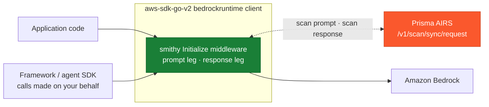
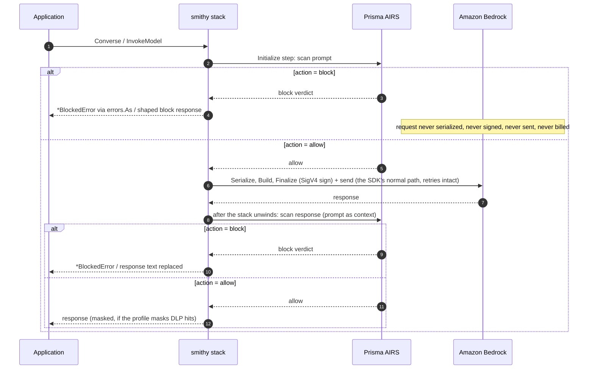

# Amazon Bedrock Go SDK Middleware Integration with Prisma AIRS

A smithy middleware for the AWS SDK for Go v2 that scans **every Amazon Bedrock model invocation** made through a protected client with Palo Alto Networks Prisma AI Runtime Security (AIRS) -- including calls a framework (LangChain Go, an agent SDK) makes on the application's behalf. A blocked prompt never leaves the process: the request is intercepted at the **Initialize step**, before it is serialized, before SigV4 signing, and before any network I/O -- so nothing reaches AWS and nothing is billed.

One package, depending only on the AWS SDK for Go v2 (which the application already has). Covers `Converse`, `ConverseStream`, `InvokeModel`, and `InvokeModelWithResponseStream`.

## Coverage

> For detection categories and use cases, see the [Prisma AIRS documentation](https://pan.dev/prisma-airs/api/airuntimesecurity/usecases/).

| Scanning Phase | Supported | Description |
|----------------|:---------:|-------------|
| Prompt | ✅ | Every model call through the client is scanned pre-flight; a blocked prompt is never signed, sent, or billed |
| Response | ✅ | `Converse` and `InvokeModel` responses are scanned (and can be rewritten or masked) before the application sees them |
| Streaming | ⚠️ | The prompt leg of `ConverseStream` / `InvokeModelWithResponseStream` is fully scanned; the streamed response itself is not (it is still on the wire when the middleware runs) |
| Pre-tool call | ❌ | There is no separate tool decision point at this seat. The `toolUse` block a reply carries -- the tool name and its arguments -- is scanned as part of the response leg, but the middleware cannot stop an individual tool call; the agent-loop integrations own that leg |
| Post-tool call | ❌ | Same -- a `toolResult` block is scanned as content of the next request's prompt leg, not as a `tool_event` of its own |

## Architecture

**Where it stands**



**The request lifecycle**



## Why this seat

A Bedrock guardrail is a **request parameter**: every call site must remember to pass `GuardrailConfig`, and a call without it -- a new code path, a framework internal, a developer shortcut -- is silently unguarded. A smithy middleware is registered **on the client**: every call through it is scanned, whoever makes it. And it composes upward: attach it with `config.WithAPIOptions` and **every client built from that `aws.Config` is protected**, this service and beyond (the middleware type-switches on the four Bedrock Runtime input types and is a no-op everywhere else). The two compose well; this integration is the safety net under whatever else is configured.

The interception uses the SDK's own extension seams, not monkey-patching: `Options.APIOptions` is the SDK's public list of middleware-stack mutators, applied to every operation's stack. The middleware sits at the Initialize step -- before serialization, before the retry loop, and before the `"Signing"` Finalize middleware -- so a returned error aborts the call with nothing sent, and the code after `next` receives the fully deserialized typed output (once, outside the retry loop) and may rewrite it before the caller sees it. Every claim in this paragraph is established from the SDK's actual source, with quoted evidence, in [seam-notes.md](./seam-notes.md).

## Setup

### Prerequisites

- Prisma AIRS API key and security profile ([Strata Cloud Manager](https://stratacloudmanager.paloaltonetworks.com))
- Go 1.24+ with the AWS SDK for Go v2

### Installation

Copy the [`prismaairs/`](./prismaairs/) package into your module and attach it at either level:

```go
import (
    "github.com/aws/aws-sdk-go-v2/config"
    "github.com/aws/aws-sdk-go-v2/service/bedrockruntime"
    "github.com/aws/smithy-go/middleware"

    "yourmodule/prismaairs"
)

// One client:
client := bedrockruntime.NewFromConfig(awsCfg,
    prismaairs.WithProtection(prismaairs.Config{AppName: "support-chat"}))

// Or the whole config: every client later built from awsCfg is protected.
awsCfg, err := config.LoadDefaultConfig(ctx,
    config.WithAPIOptions([]func(*middleware.Stack) error{
        prismaairs.APIOption(prismaairs.Config{AppName: "support-chat"}),
    }))
```

Attach it once -- per client **or** per config, not both -- or every call is scanned twice.

### Configure environment

| Variable | Required | Description |
|----------|----------|-------------|
| `PRISMA_AIRS_API_KEY` | yes | API key from Strata Cloud Manager |
| `PRISMA_AIRS_PROFILE_NAME` | yes | AIRS security profile name (or set `ProfileName` / `ProfileID`) |
| `PRISMA_AIRS_URL` | no | EU endpoint if needed; defaults to US. HTTPS enforced, redirects refused |

### Verify

```bash
cp examples/env.example .env   # fill in, then:  set -a; source .env; set +a
./scripts/validate.sh
```

Thirteen live-API checks -- **no AWS credentials needed**: a blocked call short-circuits before signing, so the whole block path is proven through a real client with placeholder credentials. See [Testing](#testing).

## Configuration

```go
prismaairs.WithProtection(prismaairs.Config{
    AppName:       "support-chat",        // -> metadata.app_name = "AWS-Bedrock-support-chat"
    ProfileName:   "",                    // overrides PRISMA_AIRS_PROFILE_NAME
    ProfileID:     "",                    // AI profile UUID; name or id must resolve
    SessionID:     "",                    // conversation id for SCM session correlation
    AppUser:       "",                    // end-user identity for metadata.app_user
    OnBlock:       prismaairs.BlockRaise, // BlockRaise *BlockedError | BlockRespond shaped block reply
    OnVerdict:     nil,                   // func(leg string, verdict map[string]any) observer for every scan
    OnError:       prismaairs.Block,      // Block | Allow when AIRS is unreachable / errors
    OnUnscannable: prismaairs.Block,      // Block | Allow when no text can be extracted
    StrictVerdict: false,                 // treat detection-service timeout/error as OnError
    ApplyMaskedData: false,               // masked text replaces the response on mask-and-allow DLP verdicts
    ScanPrompt:    prismaairs.On,         // prismaairs.Off disables a leg; the zero value is on
    ScanResponse:  prismaairs.On,
    Timeout:       10 * time.Second,      // per scan (two scans per round trip); zero = 10s
})
```

The zero-value `Config{}` is a working, fail-closed configuration (given the environment variables above).

**What gets scanned.** For `Converse`/`ConverseStream`, the prompt leg covers **the system prompt and every user-role message** -- the `System` content blocks plus every user-role turn, not just the newest one, since a single call can smuggle instructions in any of them -- including text nested in `guardContent`, `toolResult` (text, JSON and `searchResult` sub-blocks), `searchResult`, `reasoningContent` and `citationsContent` blocks. The response leg covers the assistant message the same way, including the `toolUse` block a tool-calling reply carries -- the tool name and its arguments are model-emitted output and are scanned as such.

The block walker is an **allowlist**: it recognizes the text-bearing shapes above, treats documents, images, video, audio and provider-encrypted reasoning as content that cannot be inspected, and treats **any block shape it does not recognize the same way** -- so a content type added to the Bedrock API after this was written fails closed instead of silently vanishing from the scan. Everything in that second group follows the `OnUnscannable` posture (blocked by default; set `prismaairs.Allow` for multimodal apps and pair with deeper controls). A `cachePoint` block is the one recognized exception: it is a prompt-cache marker carrying no content, so it neither contributes text nor trips the posture.

For `InvokeModel`, the known body dialects are extracted precisely -- `messages`-array bodies in both spellings (blocks named by key, as Amazon Nova writes them, and the type-tagged **messages dialect** whose blocks carry `"type": "text" | "tool_use" | "tool_result" | "thinking"`, recursing into a `tool_result`'s nested content), including the top-level `system` field; Amazon Titan, Meta and Mistral; and Cohere chat, where the newest `message`, every `chat_history` turn, the retrieved `documents` and any `tool_results` fed back are all scanned. **Unknown dialects fall back to scanning the entire serialized body** -- unknown models err toward inspecting too much, never too little. `metadata.ai_model` is stamped automatically from the input's `ModelId` on both scan legs, and `transaction_id` is generated per call (a crypto/rand UUID) and echoed in the verdict.

**`ScanPrompt: prismaairs.Off` transmits nothing from the request.** The response leg normally re-sends the prompt as context alongside the response, but only a prompt the prompt leg has already scanned qualifies: with the prompt leg disabled, the response scan carries the response alone.

**Two blocking styles.** `OnBlock: prismaairs.BlockRaise` (default) returns a `*BlockedError` carrying the leg, category, scan id, transaction id, operation, and full verdict -- recover it with `errors.As`, it travels inside the SDK's standard `*smithy.OperationError` wrapper. `OnBlock: prismaairs.BlockRespond` delivers a well-formed response instead -- a `content_filtered` Converse reply (or JSON body for `InvokeModel`) whose text states the block, with the verdict attached to the output's `ResultMetadata` (read it with `prismaairs.GetBlockInfo`) -- for callers that cannot be taught a new error type. One honest exception: the two streaming operations' outputs cannot be fabricated (their event stream field is unexported in the SDK), so blocks on `ConverseStream` / `InvokeModelWithResponseStream` always surface as `*BlockedError`, even in respond mode.

**Masked DLP output.** With `ApplyMaskedData: true`, a response-leg verdict that *allows* the call but carries `response_masked_data` has the masked text substituted into the delivered response. For `Converse` the substitution happens **in place, in the existing text blocks**: the first text block takes the masked text, any further text blocks are blanked, and every other block -- a `toolUse` the agent loop is waiting on above all -- is left untouched, with `stopReason` unchanged. (An `InvokeModel` body has no typed block to rewrite, so it is replaced whole and becomes `{"prisma_airs": "response replaced", "text": "..."}`.) If there is no text block to carry the substitution -- a tool-call-only reply, for instance -- the response is withheld exactly like a response-leg block (`mask_unappliable`) rather than delivered unmasked. Masking only takes effect on **mask-and-allow** DLP verdicts: in field testing against a live profile, AWS access keys in a response came back `action=allow` with `response_masked_data` ("The service key is XXXX..."), while SSN, card, and IBAN patterns blocked outright -- blocked patterns never reach the masking path.

**Error responses pass through.** An AWS error (throttle, auth failure, validation error) carries no model output; the middleware steps aside so the SDK returns the genuine error instead of masking it with a scan verdict.

**Fail-closed by default.** Missing credentials, an unreachable or erroring AIRS API, a verdict without an `action`, unextractable content, and any content block shape the walker does not recognize all block unless `OnError: prismaairs.Allow` / `OnUnscannable: prismaairs.Allow` is chosen explicitly. Extraction itself can never break the call it protects: a request or response shape that makes the walker fail is reported and treated as unscannable, so the posture decides rather than a panic reaching the caller.

## Logging

One line per scan leg through the standard `log` package, carrying the operation name, `transaction_id`, detection flags, and latency:

```
2026/08/18 14:05:12 prisma_airs {"action":"block","category":"malicious","detected":{"prompt_detected":["injection"]},"leg":"prompt","ms":522.4,"operation":"Converse","scan_id":"...","transaction_id":"b7dd..."}
```

## Testing

```bash
# Core checks against the live AIRS API -- no AWS account or credentials
./scripts/validate.sh            # or: go run ./scripts/validate

# Also run real Bedrock round trips (needs AWS credentials + model access)
./scripts/validate.sh --bedrock
```

The core run proves: injection blocked before signing (through a real client whose placeholder credentials would fail if the request were ever sent, with `*BlockedError` recovered through `errors.As`), the shaped-response block style, InvokeModel dialect extraction in both the key-named and the type-tagged messages spelling (the latter with the attack nested in a `tool_result`), the unknown-dialect fallback, the widened extraction surface (a system-prompt injection, an injection in an earlier user turn, an indirect injection carried in a retrieved `searchResult` passage, and opaque multimodal content failing closed without spending a scan), benign traffic passing through to AWS's own machinery, fail-closed behavior with an unreachable endpoint, and session-id echo. The `--bedrock` round trip attaches the middleware at the `aws.Config` level, proving the fleet-wide seam.

## Limitations

- **Streamed responses are not scanned.** For the two streaming operations the response is still an event stream on the wire when the middleware regains control; only their prompt leg is scanned. Buffer-then-scan proxies (an AI gateway) are the pattern when streamed output must be enforced.
- **Respond mode is raise-only for streaming operations.** The SDK keeps stream outputs behind unexported fields, so a well-formed substitute cannot be constructed; blocks on `ConverseStream` / `InvokeModelWithResponseStream` always surface as `*BlockedError` (see [seam-notes.md](./seam-notes.md)).
- **Tool calls are not scanned as tool events.** At this seat, tool use and tool results are content inside Converse messages: a `toolUse` block is scanned with the response that carries it and a `toolResult` block with the next request, but neither is a decision point the middleware can stop on its own. The agent-loop integrations ([bedrock-agentcore](../../bedrock-agentcore/), [strands-agents](../../strands-agents/)) scan them as first-class `tool_event` payloads.
- **Assistant-role turns and tool specifications are not scanned.** The prompt leg walks the `System` field and user-role messages; assistant-role messages replayed as conversation history, and the `ToolConfig` tool specifications, are not sent to AIRS. Model output is scanned on the response leg when it is produced, not again when it is replayed.
- **This client only.** The middleware protects clients it is registered on (or built from a protected `aws.Config`). Other clients, other processes, other languages, and raw HTTPS calls to Bedrock are not covered -- for fleet-wide enforcement, combine with network-layer inspection.
- **Latency.** Two sequential scans per round trip; each capped by `Timeout` (default 10 s), with timeouts following the `OnError` posture.
- **Unknown InvokeModel dialects** are scanned as raw serialized JSON -- detection quality on structure-heavy bodies may differ from clean extracted text.
- **DLP masking is opt-in.** Masked text is applied only with `ApplyMaskedData: true`; by default a mask-and-allow profile's `response_masked_data` is visible to the `OnVerdict` observer and the response is delivered unmodified.
- **Masking substitutes one text field.** AIRS masks the scanned response as a single string, so the substitution puts that whole string in the reply's first text block and blanks any others. A reply whose text was split across several blocks comes back joined; the non-text blocks around it are preserved.

## Resources

- [Prisma AIRS API Reference](https://pan.dev/airs/)
- [Amazon Bedrock Runtime API](https://docs.aws.amazon.com/bedrock/latest/APIReference/API_Operations_Amazon_Bedrock_Runtime.html)
- [AWS SDK for Go v2 middleware](https://aws.github.io/aws-sdk-go-v2/docs/middleware/)
- [Strata Cloud Manager](https://stratacloudmanager.paloaltonetworks.com)
