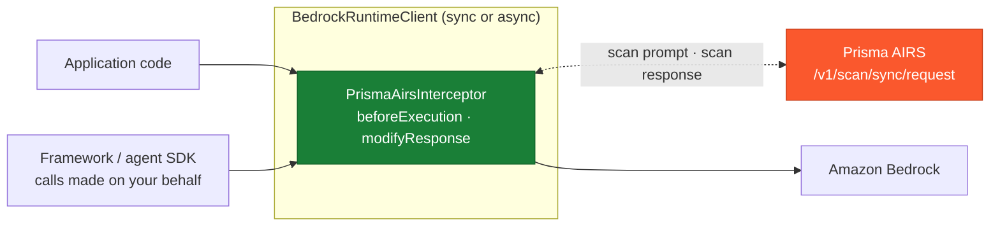
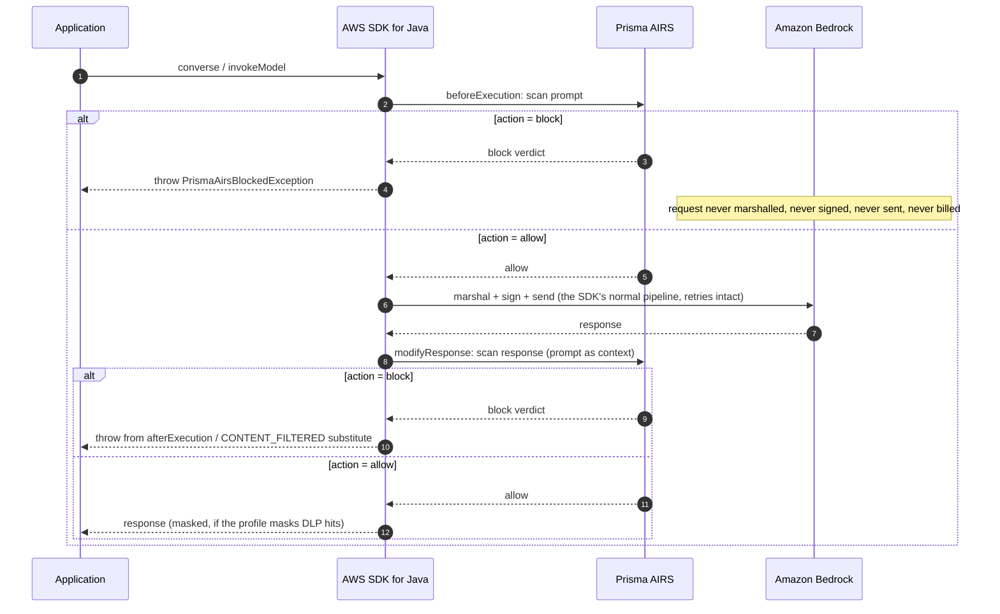

# Amazon Bedrock Java SDK Interceptor Integration with Prisma AIRS

An `ExecutionInterceptor` for the AWS SDK for Java v2 that scans **every Amazon Bedrock model invocation** made through a protected client with Palo Alto Networks Prisma AI Runtime Security (AIRS) -- including calls a framework (LangChain4j, Spring AI, an agent SDK) makes on the application's behalf. A blocked prompt never leaves the process: the request is intercepted **before it is marshalled, signed, or sent**, so nothing reaches AWS and nothing is billed.

One interceptor class plus one exception type, depending only on `software.amazon.awssdk:bedrockruntime` -- JSON handling uses the SDK's own `software.amazon.awssdk.protocols.jsoncore`, which the SDK core already carries, so the integration adds **zero third-party dependencies**. Covers `Converse`, `ConverseStream`, `InvokeModel`, and `InvokeModelWithResponseStream`.

## Coverage

> For detection categories and use cases, see the [Prisma AIRS documentation](https://pan.dev/prisma-airs/api/airuntimesecurity/usecases/).

| Scanning Phase | Supported | Description |
|----------------|:---------:|-------------|
| Prompt | ✅ | Every model call through the client is scanned pre-flight; a blocked prompt is never marshalled, signed, sent, or billed. Content coverage is the system prompt plus every user-role message -- assistant-role turns and `toolConfig` tool specs are not scanned (see [Limitations](#limitations)) |
| Response | ✅ | `Converse` and `InvokeModel` responses are scanned (and can be replaced or DLP-masked) before the application sees them, including the tool calls and reasoning text the model emits |
| Streaming | ⚠️ | The prompt leg of `ConverseStream` / `InvokeModelWithResponseStream` is fully scanned; the streamed response itself is not (it is delivered as an event stream that never materializes at this seam) |
| Pre-tool call | ❌ | Tool use rides inside Converse message content at this seat: the tool name and its arguments are scanned as message content, but there is no separate `tool_event` verdict and nothing to enforce between the model's decision and the tool's execution -- the agent-loop integrations own that leg |
| Post-tool call | ❌ | Same -- a tool result is context inside the next request, scanned as message content rather than as a scannable event of its own |

## Architecture

**Where it stands**



**The request lifecycle**



## Why this seat

A Bedrock guardrail is a **request parameter**: every call site must remember to pass `guardrailIdentifier`, and a call without it -- a new code path, a framework internal, a developer shortcut -- is silently unguarded. An `ExecutionInterceptor` inverts that, and in Java the inversion goes one step further than in any other SDK: besides per-client registration, the SDK checks every jar on the classpath for a resource file named

```
software/amazon/awssdk/global/handlers/execution.interceptors
```

and registers every interceptor listed in it on **every AWS SDK client in the JVM** -- every service, every team, every framework, every future code path. Put the interceptor on the classpath and nobody has to remember anything, at any call site or any client-construction site. The two registration paths compose with guardrails; this integration is the safety net under whatever else is configured.

The interception uses the SDK's own extension seams, not bytecode tricks or wrappers -- verified against the SDK sources in [`seam-notes.md`](./seam-notes.md):

- `beforeExecution` runs before the request pipeline exists -- before marshalling, before auth-scheme and endpoint resolution, before `SigningStage`, outside the retry loop. An exception thrown there reaches the caller **unchanged** and aborts the call before any credential is touched or any byte leaves the JVM.
- `modifyResponse` may **replace** the unmarshalled response object; whatever it returns is what the caller receives. It runs only for successful HTTP responses, so AWS's own errors surface untouched.

## Setup

### Prerequisites

- Prisma AIRS API key and security profile ([Strata Cloud Manager](https://stratacloudmanager.paloaltonetworks.com))
- Java 17+ and Maven, with `software.amazon.awssdk:bedrockruntime` on the classpath

### Installation

Copy [`PrismaAirsInterceptor.java`](./src/main/java/com/paloaltonetworks/prismaairs/PrismaAirsInterceptor.java) and [`PrismaAirsBlockedException.java`](./src/main/java/com/paloaltonetworks/prismaairs/PrismaAirsBlockedException.java) into your project (or `mvn install` this module and depend on `com.paloaltonetworks.prismaairs:prisma-airs-bedrock-interceptor`), then register the interceptor -- per client:

```java
BedrockRuntimeClient bedrock = BedrockRuntimeClient.builder()
    .overrideConfiguration(o -> o.addExecutionInterceptor(
        PrismaAirsInterceptor.builder().appName("support-chat").build()))
    .build();

bedrock.converse(...);   // scanned, both directions
```

or globally, so that **every client in the JVM is protected without touching any construction site**: add a resource file `src/main/resources/software/amazon/awssdk/global/handlers/execution.interceptors` containing one line:

```
com.paloaltonetworks.prismaairs.PrismaAirsInterceptor
```

The SDK instantiates it via the default constructor; configuration then comes entirely from the environment variables below. (Use one path or the other -- registering both would scan every call twice.)

### Configure environment

| Variable | Required | Description |
|----------|----------|-------------|
| `PRISMA_AIRS_API_KEY` | yes | API key from Strata Cloud Manager |
| `PRISMA_AIRS_PROFILE_NAME` | yes | AIRS security profile name (or set `profileName`/`profileId` on the builder) |
| `PRISMA_AIRS_URL` | no | EU endpoint if needed; defaults to US. HTTPS enforced, redirects refused |

### Verify

```bash
cp examples/env.example .env   # fill in, then:  set -a; source .env; set +a
scripts/validate.sh
```

Eleven live-API checks -- **no AWS credentials needed**: a blocked call aborts inside the SDK before signing, so the whole block path is proven through a real client with placeholder credentials. See [Testing](#testing).

## Configuration

```java
PrismaAirsInterceptor.builder()
    .appName("support-chat")          // -> metadata.app_name = "AWS-Bedrock-support-chat"
    .profileName(null)                // overrides PRISMA_AIRS_PROFILE_NAME
    .profileId(null)                  // AI profile UUID; name or id must resolve
    .sessionId(null)                  // conversation id for SCM session correlation
    .appUser(null)                    // end-user identity for metadata.app_user
    .onBlock(OnBlock.RAISE)           // RAISE PrismaAirsBlockedException | RESPOND (response leg)
    .onVerdict(null)                  // BiConsumer<String, JsonNode> observer for every scan
    .onError(Posture.BLOCK)           // BLOCK | ALLOW when AIRS is unreachable / errors
    .onUnscannable(Posture.BLOCK)     // BLOCK | ALLOW when no text can be extracted
    .strictVerdict(false)             // treat detection-service timeout/error as onError
    .applyMaskedData(false)           // masked text replaces the response on mask-and-allow profiles
    .scanPrompt(true)
    .scanResponse(true)
    .timeout(Duration.ofSeconds(10))  // per scan (two scans per round trip)
    .endpoint(null)                   // overrides PRISMA_AIRS_URL; HTTPS enforced
    .build()
```

**What gets scanned.** For `Converse`/`ConverseStream`, the prompt leg covers the system prompt (`system` content blocks) plus **every user-role message**, not just the newest one -- a single call can smuggle instructions in any of them. Within a message the content-block walker is an **allowlist**: it extracts `text`, `guardContent` text, `toolUse` (the tool name plus its serialized arguments), `toolResult` content (`text`, `json`, and nested `searchResult` passages), `reasoningContent` text, `searchResult` passages, and `citationsContent` (both the generated answer and the source text it cites). Blocks that carry payloads which cannot be inspected as text -- `document`, `image`, `video`, `audio`, a `guardContent` image, redacted reasoning -- and **any block shape the walker does not recognize, including content types Bedrock adds after this release** follow the `onUnscannable` posture (blocked by default, **even when benign text rides alongside**; set `ALLOW` for multimodal apps and pair with deeper controls). A `cachePoint` marker is recognized and ignored: it carries no model-visible content. The response leg runs the same walker over the assistant message, so a tool-calling or extended-thinking reply is scanned rather than treated as empty.

For `InvokeModel`, the known body dialects are extracted precisely and **unknown dialects fall back to scanning the entire serialized body** -- unknown models err toward inspecting too much, never too little. Both content-block dialects are walked: the Converse-shaped one, keyed by block name (`{"text": ...}`, used by Amazon Nova among others), and the **messages dialect**, where blocks are tagged by a `"type"` field (`text`, `tool_use`, `tool_result`, `thinking`, `redacted_thinking`, `image`, `document`) -- with the same system-field, every-user-turn, allowlist and opaque-content treatment in both. Also extracted: Amazon Titan `inputText`, Meta/Mistral `prompt`, and a `message`-keyed body's newest turn plus its `chat_history[].message`, with `documents[]` and `tool_results[]` scanned as serialized JSON. `metadata.ai_model` is stamped automatically from the request's model id on both scan legs, and `transaction_id` is generated per call and echoed in the verdict.

**Two blocking styles.** `OnBlock.RAISE` (default) throws `PrismaAirsBlockedException` carrying the leg, category, scan id, and transaction id -- on the prompt leg it is thrown from `beforeExecution` (nothing signed, nothing sent), and on the response leg from `afterExecution`, which sits outside the SDK's retry loop and response handler so it is never retried on either client. On the sync client it arrives unwrapped. `PrismaAirsBlockedException` extends `SdkClientException` so that the **async** client delivers the same type: the async pipeline funnels every failure through `ThrowableUtils.asSdkException`, which returns an `SdkException` unchanged and wraps anything else in a bare `SdkClientException` -- so `CompletableFuture` callers unwrap one `CompletionException` and get the typed exception, not a generic transport error. `retryable()` is `false`: a policy block is a decision, not a transport fault. One consequence for caller code: because the exception is now an `SdkException` subtype, `catch (PrismaAirsBlockedException e)` must come **before** any `catch (SdkException e)` / `catch (SdkClientException e)` -- the reverse order no longer compiles -- and async callers should unwrap one `CompletionException` and test `getCause() instanceof PrismaAirsBlockedException`. `OnBlock.RESPOND` replaces a blocked **response** with a well-formed reply instead -- a `CONTENT_FILTERED` `ConverseResponse` (or a JSON body for `InvokeModel`) whose text states the block -- for callers that cannot be taught a new exception. One honest divergence from the boto3 sibling: `ExecutionInterceptor` has no seam that can short-circuit the HTTP call with a synthetic response, so a blocked **prompt** still raises even in RESPOND mode -- throwing is the only abort that prevents signing and transmission (verified in [`seam-notes.md`](./seam-notes.md)).

**Masked data.** With `applyMaskedData(true)`, a response-leg **allow** verdict that carries `response_masked_data.data` -- a mask-and-allow DLP profile -- has the masked text substituted for the model output before the caller sees it. For a `ConverseResponse` the substitution happens **in place**: the masked text goes into the first text block, any further text blocks are blanked, and every other block is left untouched -- a `toolUse` block on an allowed agent turn survives, and `stopReason` is never rewritten. An `InvokeModel` body becomes `{"prisma_airs": "response masked", "text": ...}`. The outcome is logged as `masked`; if a response shape cannot carry the substitution, the call fails closed exactly like a response-leg block (`mask-unappliable`) -- the unmasked original is never delivered. Note that masking is a per-detector profile behavior, not a mode this option turns on: on a real profile we measured AWS access keys in responses coming back `action=allow` **with** `response_masked_data` ("The service key is XXXX..."), while SSN/card/IBAN patterns blocked outright.

**Error responses pass through.** An AWS error (throttle, auth failure, validation error) carries no model output; the SDK routes it through its error handler without ever invoking the response-scanning hooks, so the genuine AWS exception surfaces instead of being masked by a scan verdict -- structurally, with zero code in this integration.

**Fail-closed by default.** Missing credentials, an unreachable or erroring AIRS API, a verdict without an `action`, any request content block that cannot be read as text (including one this walker does not recognize), and a response nothing can be extracted from all block unless `onError(ALLOW)` / `onUnscannable(ALLOW)` is chosen explicitly.

## Logging

One line per scan leg on the `java.util.logging` logger named `prisma_airs`, `INFO` for allows and neutral outcomes (stream-response skips, masking applied, unscannable content under the `ALLOW` posture) and `WARNING` for blocks and errors, carrying the operation name, `transaction_id`, detection flags, and latency:

```
WARNING: prisma_airs {"leg":"prompt","action":"block","transaction_id":"b7dd...","ms":522.4,"operation":"Converse","category":"malicious","scan_id":"...","detected":{"prompt_detected":["injection"]}}
```

## Testing

```bash
# Core checks against the live AIRS API -- no AWS account or credentials
scripts/validate.sh

# Also run a real Bedrock round trip (needs AWS credentials + model access)
scripts/validate.sh --bedrock
```

The core run proves: injection blocked before signing (through a real client whose placeholder credentials would fail if the request were ever sent), the documented RESPOND-mode prompt-leg behavior, InvokeModel dialect extraction, the unknown-dialect fallback, the widened extraction surface (injection in the `system` field and in an earlier user turn both caught by real verdicts; an image beside benign text failing closed as unscannable without spending a scan), benign traffic passing through to AWS's own machinery, fail-closed behavior with an unreachable endpoint, and session-id echo. The blocked-injection checks pass only on a real verdict category -- a fail-closed `airs_error` block (dead key, unreachable endpoint) reports failure with a hint instead of a hollow PASS.

## Limitations

- **Streamed responses are not scanned.** The two streaming operations exist only on the async client and deliver their output as an event stream that is still on the wire at this seam; only their prompt leg is scanned (the skip is logged). Buffer-then-scan proxies (an AI gateway) are the pattern when streamed output must be enforced.
- **A blocked prompt always raises.** `ExecutionInterceptor` cannot substitute a response before transmission, so `OnBlock.RESPOND` applies to the response leg only; prompt-leg blocks throw `PrismaAirsBlockedException` in both modes.
- **Tool calls are not scanned as tool events.** At this seat, tool use and tool results are content inside Converse messages: their text and serialized arguments are scanned as message content, but not as first-class `tool_event` payloads with their own verdict. The agent-loop integrations ([bedrock-agentcore](../../bedrock-agentcore/), [strands-agents](../../strands-agents/)) do that.
- **Assistant-role turns and `toolConfig` are not scanned.** The prompt leg walks the `system` field and every **user-role** message. Assistant-role turns replayed from conversation history, and the tool specifications in `toolConfig` (names, descriptions, input schemas -- all model-visible text), reach the model uninspected. Where that history is attacker-influenced, scan it before you hand it to the client.
- **The response leg has no opaque posture.** On the request leg an unreadable block fails closed. On the response leg the posture applies only when *nothing* could be extracted (`unscannable`); a reply that mixes text with an unreadable block -- redacted reasoning, say -- is scanned on the text it does carry.
- **The response leg blocks the async client's event-loop thread.** `ExecutionInterceptor.modifyResponse` has a synchronous return type and no async variant, so the scan HTTP call runs to completion inside it. On `BedrockRuntimeAsyncClient` that hook is invoked from the Netty channel's event loop, which is shared (`2 x cores` threads by default) with every other in-flight request on that client -- so a slow AIRS round trip head-of-line-blocks unrelated calls, and the Netty timers that would catch it are scheduled on the very loop that is parked. Async deployments should give the client a dedicated, generously sized `SdkEventLoopGroup` (`NettyNioAsyncHttpClient.builder().eventLoopGroup(...)`), keep `timeout(...)` short, or set `scanResponse(false)` and accept losing response-leg coverage. The sync client is unaffected: the scan runs on the caller's own thread.
- **This JVM only.** Per-client registration protects the clients it is added to; classpath auto-discovery protects every client in the JVM. Other processes, other languages, and raw HTTPS calls to Bedrock are not covered -- for fleet-wide enforcement, combine with network-layer inspection.
- **Masking only takes effect on mask-and-allow DLP verdicts.** `applyMaskedData(true)` applies `response_masked_data` when the profile returns it on an allow; detectors that block outright (we measured SSN/card/IBAN blocking while AWS access keys came back mask-and-allow) still follow the block path, and profiles that never mask make the option a no-op.
- **Latency.** Two sequential scans per round trip; each capped by `timeout(...)` (default 10 s), with timeouts following the `onError` posture.
- **Unknown InvokeModel dialects** are scanned as raw serialized JSON -- detection quality on structure-heavy bodies may differ from clean extracted text.

## Resources

- [Prisma AIRS API Reference](https://pan.dev/airs/)
- [Amazon Bedrock Runtime API](https://docs.aws.amazon.com/bedrock/latest/APIReference/API_Operations_Amazon_Bedrock_Runtime.html)
- [AWS SDK for Java v2 ExecutionInterceptor](https://sdk.amazonaws.com/java/api/latest/software/amazon/awssdk/core/interceptor/ExecutionInterceptor.html)
- [Strata Cloud Manager](https://stratacloudmanager.paloaltonetworks.com)
