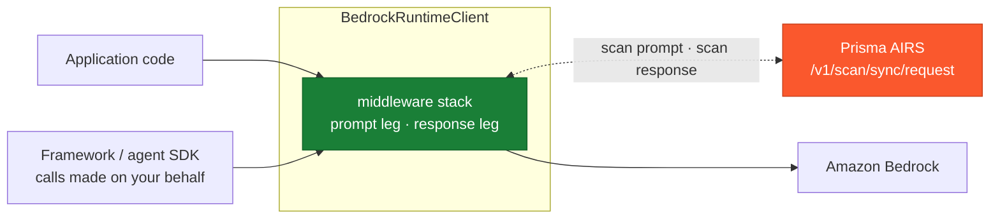
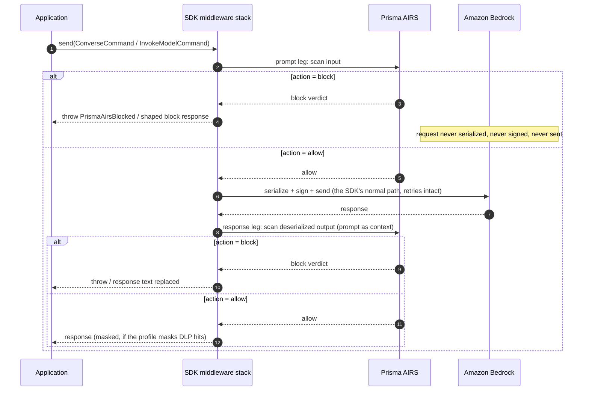

# Amazon Bedrock SDK Hook for Node.js with Prisma AIRS

A middleware for the AWS SDK for JavaScript (v3) middleware stack that scans **every Amazon Bedrock model invocation** made through a protected client with Palo Alto Networks Prisma AI Runtime Security (AIRS) -- including calls a framework (LangChain.js, LlamaIndex.TS, an agent SDK) makes on the application's behalf. A blocked prompt never leaves the process: the middleware chain is abandoned **before the request is serialized, signed, or sent**, so nothing reaches AWS and nothing is billed.

One file, zero dependencies beyond the `@aws-sdk/client-bedrock-runtime` the application already has. Covers `Converse`, `ConverseStream`, `InvokeModel`, and `InvokeModelWithResponseStream`.

## Coverage

> For detection categories and use cases, see the [Prisma AIRS documentation](https://pan.dev/prisma-airs/api/airuntimesecurity/usecases/).

| Scanning Phase | Supported | Description |
|----------------|:---------:|-------------|
| Prompt | ✅ | Every model call through the client is scanned pre-flight; a blocked prompt is never signed, sent, or billed |
| Response | ✅ | `Converse` and `InvokeModel` responses are scanned (and can be rewritten or masked) before the application sees them |
| Streaming | ⚠️ | The prompt leg of `ConverseStream` / `InvokeModelWithResponseStream` is fully scanned; the streamed response itself is not (it is still on the wire when the middleware returns) |
| Pre-tool call | ⚠️ | The `toolUse` name and arguments a model emits are scanned as response content, so a blocked tool call never reaches the application -- but only for non-streaming responses, and as message content rather than as a `tool_event` payload |
| Post-tool call | ⚠️ | Tool results are scanned as `toolResult` content on the next request's prompt leg -- after the tool ran, and again as message content, not as a `tool_event` |

## Architecture

**Where it stands**



**The request lifecycle**



## Why this seat

A Bedrock guardrail is a **request parameter**: every call site must remember to pass `guardrailIdentifier`, and a call without it -- a new code path, a framework internal, a developer shortcut -- is silently unguarded. A middleware is registered **on the client object**: every command sent through it is scanned, whoever sends it. The two compose well; this integration is the safety net under whatever else is configured.

The interception uses the SDK's own extension seam, not monkey-patching: `client.middlewareStack.add()` is the public API AWS documents for exactly this. The hook registers once, at step `initialize` with priority `high` -- the outermost position. On the way in it sees the unserialized command input, and throwing (or returning early) there abandons the chain before the `serialize`, `build`, and `finalizeRequest` steps, so nothing is serialized, SigV4 never runs, and no socket is opened. On the way out, its `await next(args)` resolves only after the `deserialize` step has parsed the operation output, so it can scan and replace that output before the caller's promise resolves. [seam-notes.md](./seam-notes.md) documents the step order, the signing seat, and the abort semantics with quoted SDK source.

## Setup

### Prerequisites

- Prisma AIRS API key and security profile ([Strata Cloud Manager](https://stratacloudmanager.paloaltonetworks.com))
- Node.js 18+ with `@aws-sdk/client-bedrock-runtime` (v3)

### Installation

Copy [`prisma-airs-hook.mjs`](./prisma-airs-hook.mjs) next to your application code and protect the client:

```js
import { BedrockRuntimeClient, ConverseCommand } from "@aws-sdk/client-bedrock-runtime";
import { protectClient } from "./prisma-airs-hook.mjs";

const bedrock = protectClient(new BedrockRuntimeClient({}), { appName: "support-chat" });

await bedrock.send(new ConverseCommand({ /* ... */ }));   // scanned, both directions
```

The hook itself has no npm dependencies (the `package.json` here only declares the SDK as a peer); it uses the platform's global `fetch` and `node:crypto`.

### Configure environment

| Variable | Required | Description |
|----------|----------|-------------|
| `PRISMA_AIRS_API_KEY` | yes | API key from Strata Cloud Manager |
| `PRISMA_AIRS_PROFILE_NAME` | yes | AIRS security profile name (or pass `profileName` / `profileId`) |
| `PRISMA_AIRS_URL` | no | EU endpoint if needed; defaults to US. HTTPS enforced, redirects refused |

### Verify

```bash
npm install @aws-sdk/client-bedrock-runtime   # if your app does not already have it
cp examples/env.example .env                  # fill in, then:  set -a; source .env; set +a
node scripts/validate.mjs
```

Eleven live-API checks -- **no AWS credentials needed**: a blocked call short-circuits before signing, so the whole block path is proven through a real client with placeholder credentials. See [Testing](#testing).

## Configuration

```js
protectClient(client, {
  appName: "support-chat",   // -> metadata.app_name = "AWS-Bedrock-support-chat"
  profileName: null,         // overrides PRISMA_AIRS_PROFILE_NAME
  profileId: null,           // AI profile UUID; name or id must resolve
  sessionId: null,           // conversation id for SCM session correlation
  appUser: null,             // end-user identity for metadata.app_user
  onBlock: "raise",          // "raise" PrismaAirsBlocked | "respond" with a shaped block reply
  onVerdict: null,           // (leg, verdict) => {} observer for every scan
  onError: "block",          // "block" | "allow" when AIRS is unreachable / errors
  onUnscannable: "block",    // "block" | "allow" when no text can be extracted
  strictVerdict: false,      // treat detection-service timeout/error as onError
  applyMaskedData: false,    // masked text replaces the response TEXT on mask-and-allow profiles
  scanPrompt: true,
  scanResponse: true,
  timeoutMs: 10000,          // per scan (two scans per round trip)
});
```

**What gets scanned.** For `Converse`/`ConverseStream`, the prompt leg covers **the system prompt and every user-role message** (a single call can smuggle instructions in any of them), walking each content block that carries text: `text`, text nested in `guardContent`, `toolResult` text and `json` payloads, `searchResult` passages (the usual indirect-injection carrier), `reasoningContent` text, `citationsContent` answers with the sources they cite, and the name plus serialized arguments of a `toolUse` block. The response leg walks the assistant message the same way, so the tool arguments a model emits are scanned before the application acts on them. For `InvokeModel`, the known body dialects are extracted precisely -- messages-style chat bodies, both the plain `{text}` blocks Amazon Nova uses and the type-tagged **messages dialect** (`tool_use` arguments, `tool_result` content, `thinking` blocks) with a top-level `system` string or block list, plus Titan, Meta, Mistral and Cohere Chat (`message`, `chat_history`, `documents`, `tool_results`) -- and **unknown dialects fall back to scanning the entire serialized body**, so unknown models err toward inspecting too much rather than too little.

The extractors are allowlists, not blocklists: a block shape they do not recognize -- documents, images, video, audio, encrypted reasoning, or a content type Bedrock adds after this file was written -- marks the **prompt** unscannable instead of quietly dropping it from a scan that still reports `allow`, and the `onUnscannable` posture governs (blocked by default; set `"allow"` for multimodal apps and pair with deeper controls). An extractor that cannot walk a body at all is treated the same way, never raised at the caller. `metadata.ai_model` is stamped automatically from the command's `modelId` on both scan legs, and `transaction_id` is generated per call and echoed in the verdict.

**Two blocking styles.** `onBlock: "raise"` (default) throws `PrismaAirsBlocked` carrying the leg, verdict, and transaction id. `onBlock: "respond"` delivers a well-formed response instead -- a `content_filtered` Converse reply on either leg (a withheld response is re-stamped `content_filtered`, so an agent loop is never left branching on a `tool_use` whose block has been removed), a JSON body for `InvokeModel` that answers `transformToString()` like a real one, or a minimal valid event stream for the two streaming operations (an async iterable the standard `for await` consumer loop plays back like a real reply) -- whose text states the block, with the verdict attached under `$prismaAirs`, for callers that cannot be taught a new exception. Protecting the same client twice is a no-op, never a double scan, and protection clears any cached resolved handlers so a client protected after its first send (with `cacheMiddleware` enabled) is still covered.

**Error responses pass through.** An AWS error (throttle, auth failure, validation error) carries no model output; the deserializer rejects before the response leg runs, so the hook steps aside and the genuine SDK exception reaches the caller instead of being masked by a scan verdict.

**Fail-closed by default.** Missing credentials, an unreachable or erroring AIRS API, a verdict without an `action`, and unextractable content all block unless `onError: "allow"` / `onUnscannable: "allow"` is chosen explicitly.

## Logging

One line per scan leg, stdout for allows and neutral outcomes (stream-response skips, masking applied) and stderr for blocks and errors, carrying the operation name, `transaction_id`, detection flags, and latency. Set `logger.level = "warn"` to keep only blocks and errors, or `"silent"` to silence the hook entirely:

```
prisma_airs {"leg":"prompt","action":"block","transaction_id":"b7dd...","ms":522.4,"operation":"Converse","category":"malicious","scan_id":"...","detected":{"prompt_detected":["injection"]}}
```

## Testing

```bash
# Core checks against the live AIRS API -- no AWS account or credentials
node scripts/validate.mjs

# Also run real Bedrock round trips (needs AWS credentials + model access)
node scripts/validate.mjs --bedrock
```

The core run proves: injection blocked before signing (through a real client whose placeholder credentials would fail if the request were ever sent), the shaped-response block style, InvokeModel dialect extraction, the unknown-dialect fallback, the widened extraction surface (system-prompt and earlier-user-turn injections blocked, opaque multimodal content failing closed without spending a scan), benign traffic passing through to AWS's own machinery, fail-closed behavior with an unreachable endpoint, and session-id echo.

## Limitations

- **Streamed responses are not scanned.** For the two streaming operations the response is still on the wire when the middleware returns; only their prompt leg is scanned. Buffer-then-scan proxies (an AI gateway) are the pattern when streamed output must be enforced.
- **Tool calls are scanned as content, not as tool events.** At this seat, tool use and tool results are content inside Converse messages: a `toolUse` block contributes its name and serialized arguments to the response scan, a `toolResult` block its text and `json` payloads to the next prompt scan. They are not sent to AIRS as first-class `tool_event` payloads -- the agent-loop integrations ([bedrock-agentcore](../../bedrock-agentcore/), [strands-agents](../../strands-agents/)) do that -- and a tool call in a *streamed* reply is not scanned at all, since the response leg is skipped there.
- **Assistant-role turns and `toolConfig` are not scanned.** The prompt leg walks the system prompt and every user-role message; text an application replays in an assistant-role turn (including output from a streamed reply, which was never scanned) and the tool names, descriptions and input schemas in `toolConfig` reach the model uninspected.
- **The response leg scans the text it can extract.** An unrecognized block shape marks the *prompt* unscannable and follows `onUnscannable`; the response leg does not consume that flag, so a reply mixing text with a non-text block is scanned on its text and delivered with the other block intact. Only a reply from which no text can be extracted at all follows `onUnscannable` there.
- **Masking rewrites text blocks only.** With `applyMaskedData: true` the masked text is substituted into the response's existing text block(s) in place, so a `toolUse` block in the same benign reply survives; a reply with no text block to carry the substitution is withheld instead (`mask_unappliable`, following `onBlock`). For `InvokeModel` the whole JSON body is replaced.
- **This client only.** The hook protects clients it is registered on. Other clients, other processes, other languages, and raw HTTPS calls to Bedrock are not covered -- for fleet-wide enforcement, combine with network-layer inspection.
- **Latency.** Two sequential scans per round trip; each capped by `timeoutMs` (default 10 s), with timeouts following the `onError` posture. A scan response is read under the same deadline and refused past 10 MB, which follows that posture too.
- **Unknown InvokeModel dialects** are scanned as raw serialized JSON -- detection quality on structure-heavy bodies may differ from clean extracted text.

## Resources

- [Prisma AIRS API Reference](https://pan.dev/airs/)
- [Amazon Bedrock Runtime API](https://docs.aws.amazon.com/bedrock/latest/APIReference/API_Operations_Amazon_Bedrock_Runtime.html)
- [AWS SDK for JavaScript middleware stack](https://aws.amazon.com/blogs/developer/middleware-stack-modular-aws-sdk-js/)
- [Strata Cloud Manager](https://stratacloudmanager.paloaltonetworks.com)
